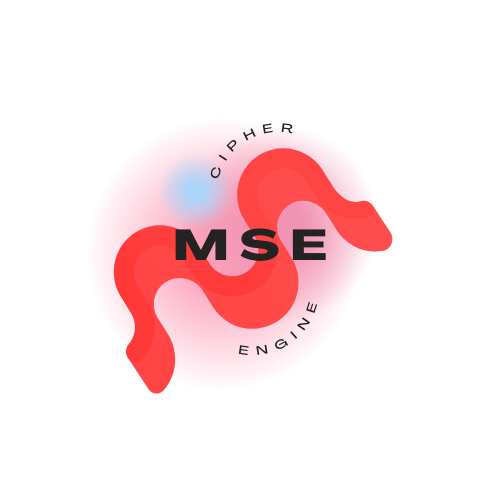

  

  # PROJET MULTIPLE SUBSTITUTION ENCRYPTION (MSE)
  -------------------------------------

  Logiciel de chiffrement par substitution multiple avec obscurcissement, pour la création de jeux d'énigme et de recherche.

  Chiffrement de texte par substitution multiple en 3 étapes.

  Nom de version: CRC XXVII [ Complex Urulu ]
  
  Auteur: Enron Group
  
  version: 27.0.1
  
  date: 23 novembre 2023
  

 

## Introduction
-------------------------------------
Le programme de Chiffrement à Substitution Multiple (MSE) est conçu pour fournir un chiffrement de texte en utilisant 3 niveaux de substitution de caractères et de complexité. Développé depuis le 22 janvier 2019, le programme propose une approche unique du chiffrement de texte.

## I. Initialisation
-------------------------------------

### BDC (Base de Données de Caractère)
les fichiers `all.txt`, `light_weight.txt` et `ultra_light_weight.txt` contient les caractères qui vont être utilisés pour substituer les caractères.

Ces caractères sont ensuite divisé en deux groupes:
  - Le group A pour générer des clé de substituion.
  - Le groupe B pour ajouter des caractères, après la substituion.

Celui devient unique à chaque utilisateur, lorsqu'il chiffre pour la première fois un message.

- Le programme commence par importer des bibliothèques essentielles et les caractères du fichier BDC, comprenant les lettres minuscules et majuscules, les chiffres, la ponctuation et les caractères accentués.

- Les paramètres de configuration sont chargés depuis un fichier `setting.json`, spécifiant l'ensemble de caractères à utiliser pour le chiffrement, l'inclusion de la ponctuation, des chiffres et des accents et d'autres paramètres.

- Elle va aussi inclure la longueur des groupes caractères qui font être choisis pour substituer, la longueur des caractères spéciaux (un groupe de caractère est choisi pour avoir une longueur plus petite), le nombre de clés et des facteurs de déplacement.

 

## II. Générateur de Configuration Aléatoire
-------------------------------------
- Le programme peut générer des paramètres (fichier `setting.json`) pseudo aléatoires. Les utilisateurs peuvent opter pour la création de configurations aléatoires.

- Avant d'être substitué, le programme applique plusieurs opérations sur le texte avant le chiffrement, le rendant complexe à déchiffrer.

 

## III. Chiffrement
-------------------------------------
- Le processus de chiffrement de base comprend 3 étapes :

  - Obscurcir le texte en le divisant en deux et en réarrangeant les caractères et appliquer des transformations supplémentaires et des améliorations de complexité.

  - Substituer les caractères en fonction des clés de chiffrement générées à partir de l'ensemble de caractères du fichier BDC.

  - Introduire des caractères dans une position choisit dans le texte de manière pseudo aléatoires du groupe B de caractères distinct.

 

## IV. Génération de Bibliothèque de Clés
-------------------------------------
- Le programme génère une bibliothèque de clés de substitution choisit à partir du groupe A.

 

## V. Outils
-------------------------------------
- Le fichier `tools.py` offre des outils essentiels tels que la génération d'une nouvelle BDC, la suppression des clés de chiffrement, le mélange des caractères du fichier BDC actuelle et le nettoyage, suppression des doublons du fichier du fichier BDC.

 
 

## VII. MSE MARS ATTACK
-------------------------------------
Le programme MSE est un jeux.
Je vous encourage vivement à particier à la recherche de faille de sécurité
en rejoinant le programme: [Mars Attack](https://discord.gg/HYpbvBSu)

 
 

## Démo et mise en application
-------------------------------------

 

##  Ressources
-------------------------------------------------------------------

Exemples de code secret: [codex.vu](https://bit.ly/theclawsofgod)

`Ceci est que la base du code, regardez le code d'un autre point de vue et vous pouvez voire des miiliards de possibilité !`

  le monde merveilleux des secrets, des lettres et des chiffres !

