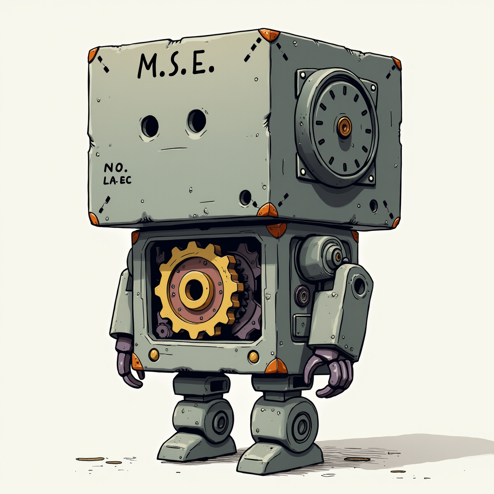

# PROJET MSE 2
-------------------------------------

# MULTIPLE SUBSTITUTION ENCRYPTION
-------------------------------------

Chiffrement par substitution multiple + obscurcissement

Programme de chiffrement de text par substitution multiple en 3 étapes.

pour but de créer des messages codés avec des messages.

**Le programme est unique à son utilisateur, vous devez partager le code entier pour pouvoir communiquer avec d'autre personne.**

**Nom de version: CRC XVIII [ GOLIATH ]**

# Comment sa fonctionne ?

### INPUT --> A --> B --> C --> output
    
    
    **Initiation**
        génération des clés de chiffrement
--------------------------------------------------------------------------
	
    **I) Bloc A**
        Une série de fonction modifie le texte entré.
--------------------------------------------------------------------------
    **II) Bloc B**
        Une clé de chiffrement est choisie au hasard.
        Chaque caractère est substitué avec cette clé.
--------------------------------------------------------------------------
    **III) Bloc C**
    	[ Obscurcissement ]
        Ajoute des caractères dans le code après la substitution.

# Exemple

En bleu vous avez les caractères qui ont été substitués et en rouge les caractères qui ont été ajoutés **après** la substitution.

# REQUIS
-------------------------------------
Pour copier le message automatiquement vous devez installez le module [pyperclip](https://pypi.org/project/pyperclip/)

	pip install pyperclip

# Attention
-----------------------------------
**Lorsque vous chiffrer votre premier message un fichier _keylib.keys_ va être généré ce sont vous clés de chiffrement gardez les à tous prix !**

# Usage
---------------------------
Usage:
	
	Mélanger les caractères spéciaux ( avec le jeu de caractère actuelle)
		mixer()

	Reconstruit le jeu de caractère actuelle
		rebuild()

	Pour chiffrer plusieurs message et le mettre dans un fichier:
		mse_cipher_file('result.txt',exemple_phrases_list)

	Pour déchiffrer plusieurs message dans un fichier:
		mse_decipher_file('exemple.txt')

	Pour supprimer les clés de chiffrement:
		reinitialiser()

	chiffrer un message:
		mse_cipher(message)

	déchiffrer:
		mse_decipher(message)

	demo:
		demo()

# Conseille et Astuces
-------------------------------------------------------------------

> Vous pouvez chiffrer autre chose que des lettres (minuscules ou majuscules) comme les ponctuations, accents et chiffres pour celà écrivez 'true' devant les carctères que vous voulez chiffrer,(_setting_.json)

> modifier,mélanger votre jeu de caractères

> modifier les paramètres du programme dans configs/setting.json

> optez plûtot pour un language de type "sms" du genre: tu fait quoi ---> tfk

> modifier la liste des ["caractères spéciaux"](https://github.com/flowlord/Multiple-Substitution-Encryption/blob/main/configs/init.py#L54)

-------------------------------------------------------------------

## Comment démarrer ?

	1) installer le module pyperclip avec l'aide de pip (pip install pyperclip)
	
	2) rendez-vous sur le main.py puis lancez le programme
		la fonction demo pour donner un exemple de message chiffré
		En même temps vous aurez générez un fichier keylib.keys
		Ce sont vos clés de chiffrement gardez les à tous prix !

	3) Explorez, modifier vos paramètres (setting.json)
	
	4) Assurez vous d'envoyer de manière sécurisé votre programme à une autre personne
		Je dit bien tous le code source et pas seulement vos clés

## Ressources
-------------------------------------------------------------------

Exemples de code secret: [codex.vu](https://bit.ly/theclawsofgod)

le monde merveilleux des secrets, des lettres et des chiffres !

twitter: https://twitter.com/motionkerling

0011211548862 - 33222 - 1452215482375L
